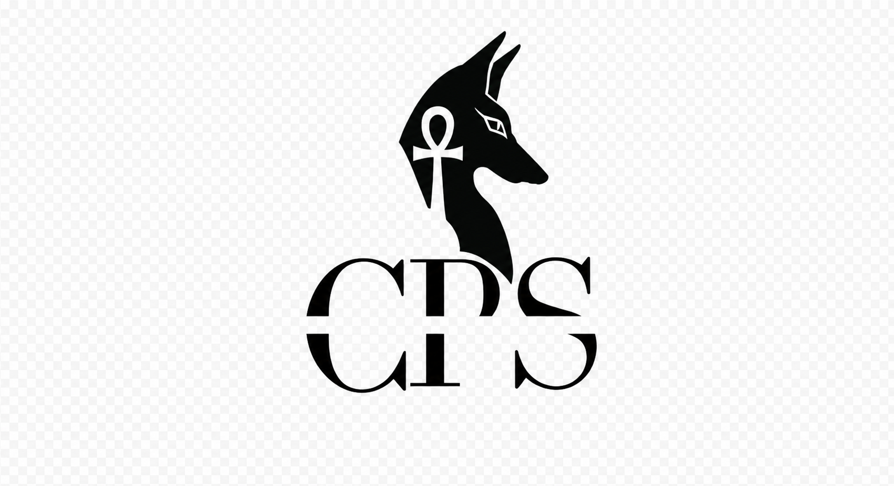

<p align="center">
  
</p>

# CP'S Enterprise Dynamics Commerce System (DCS)

<p align="center">
  <strong>The Sovereign Commerce Platform</strong><br/>
  Built with Logic of Sovereignty, Not Dependency
</p>

<p align="center">
  <a href="#architecture">Architecture</a> &bull;
  <a href="#quick-start">Quick Start</a> &bull;
  <a href="#development">Development</a> &bull;
  <a href="#documentation">Documentation</a> &bull;
  <a href="#deployment">Deployment</a>
  &bull; <a href="SECURITY.md">Security</a>
</p>

---

## Overview

CP'S Enterprise DCS is a distributed commerce platform built on **event sourcing**, **CRDTs**, and an **agentic architecture**. It is designed for offline-first retail operations with sovereign data ownership, meaning your business data stays under your control at all times.

### Core Principles

- **Sovereign Data** — Full data ownership with envelope encryption (AES-256-GCM + HashiCorp Vault)
- **Offline-First** — Business operations continue during complete network isolation (up to 72 hours)
- **Event Sourcing** — Immutable, append-only audit trail for compliance and forensics
- **CRDT Consistency** — Conflict-free replicated data types guarantee convergence without coordination
- **Agentic Intelligence** — Autonomous agents manage operations across local, regional, and global levels

---

## Architecture

```
┌────────────────────────────────────────────────────────────────────────────────┐
│                       CP'S Enterprise DCS v4.0                              │
├────────────────────────────────────────────────────────────────────────────────┤
│                                                                             │
│  ┌─────────────────┐    ┌─────────────────┐    ┌─────────────────┐         │
│  │   RockDeals POS │    │   RockDeals POS │    │   RockDeals POS │         │
│  │   (React/TS)    │    │   (React/TS)    │    │   (React/TS)    │         │
│  └────────┬────────┘    └────────┬────────┘    └────────┬────────┘         │
│           │                      │                      │                   │
│           ▼                      ▼                      ▼                   │
│  ┌─────────────────┐    ┌─────────────────┐    ┌─────────────────┐         │
│  │   Local Agent   │    │   Local Agent   │    │   Local Agent   │         │
│  │   (Python)      │    │   (Python)      │    │   (Python)      │         │
│  │  • SQLite/gRPC  │    │  • SQLite/gRPC  │    │  • SQLite/gRPC  │         │
│  │  • CRDTs        │    │  • CRDTs        │    │  • CRDTs        │         │
│  └────────┬────────┘    └────────┬────────┘    └────────┬────────┘         │
│           └──────────────────────┼──────────────────────┘                   │
│                                  ▼                                          │
│  ┌──────────────────────────────────────────────────────────────────────┐   │
│  │                   Regional Agent (Go)                            │       │
│  │  • Raft Consensus   • CRDT Aggregation   • PostgreSQL Store     │       │
│  └──────────────────────────────────────────────────────────────────────┘   │
│                                                                             │
└────────────────────────────────────────────────────────────────────────────────┘
```

### Repository Structure

```
.
├── app/                                    # Main admin frontend (React 19 + Vite)
│   ├── src/
│   │   ├── components/ui/                  # shadcn/ui component library
│   │   └── App.tsx
│   ├── package.json
│   └── vite.config.ts
│
├── cps-enterprise-dcs/                     # Core platform modules
│   ├── pos-interface/                      # RockDeals POS frontend (React 18 + Vite)
│   │   ├── src/
│   │   │   ├── components/                 # ProductGrid, Cart, etc.
│   │   │   ├── store/                      # Zustand state management
│   │   │   └── App.tsx
│   │   └── package.json
│   │
│   ├── local-agent/                        # Edge computing agent (Python 3.11+)
│   │   ├── src/
│   │   │   ├── agent.py                    # Core agent logic
│   │   │   ├── crdt.py                     # CRDT implementations
│   │   │   ├── event_store.py              # SQLite event store
│   │   │   ├── grpc_server.py              # gRPC service
│   │   │   ├── security.py                 # Envelope encryption
│   │   │   └── main.py                     # Entry point
│   │   ├── requirements.txt
│   │   └── Dockerfile
│   │
│   ├── regional-agent/                     # Regional coordination agent (Go 1.21+)
│   │   ├── internal/
│   │   │   ├── agent/                      # Raft-based agent
│   │   │   ├── config/                     # Configuration
│   │   │   ├── crdt/                       # CRDT manager (GCounter, PNCounter, ORSet, LWWRegister)
│   │   │   └── server/                     # gRPC server
│   │   ├── main.go
│   │   ├── go.mod
│   │   └── Dockerfile
│   │
│   ├── event-store/                        # PostgreSQL event store schema
│   │   └── schema.sql                      # Partitioned tables, RLS, triggers
│   │
│   ├── proto/                              # Protocol Buffers definitions
│   │   └── cps_enterprise_v4.proto         # gRPC service & message definitions
│   │
│   ├── infrastructure/                     # Docker Compose deployment
│   │   └── docker-compose.yml              # Full stack (Postgres, Redis, Kafka, Vault, etc.)
│   │
│   └── .env.example                        # Environment variable template
│
├── docs/                                   # Documentation
│   ├── architecture.md                     # System architecture deep-dive
│   ├── development.md                      # Developer setup guide
│   ├── api.md                              # API reference
│   └── deployment.md                       # Deployment guide
│
├── Makefile                                # Build, test, lint, run commands
└── README.md                               # This file
```

### Technology Stack

| Component | Technology | Purpose |
|-----------|------------|---------|
| **Admin App** | React 19, TypeScript, Vite 7, shadcn/ui | Administration dashboard |
| **POS Interface** | React 18, TypeScript, Vite, Zustand, Tailwind | Cashier point-of-sale |
| **Local Agent** | Python 3.11+, gRPC, SQLite, asyncio | Edge computing & offline ops |
| **Regional Agent** | Go 1.21+, Raft, gRPC, BoltDB | Regional consensus & coordination |
| **Event Store** | PostgreSQL 16, partitioned tables | Immutable event log |
| **Message Bus** | Apache Kafka 7.5 | Event streaming |
| **Cache** | Redis 7 | Session & idempotency cache |
| **Secrets** | HashiCorp Vault 1.15 | Envelope encryption key management |
| **Monitoring** | Prometheus, Grafana, OpenTelemetry | Observability |

---

## Quick Start

### Prerequisites

| Tool | Version | Purpose |
|------|---------|---------|
| Node.js | 18+ | Frontend builds |
| Python | 3.11+ | Local agent |
| Go | 1.21+ | Regional agent |
| Docker & Compose | 24.0+ / 2.20+ | Infrastructure services |

### 1. Clone and Install

```bash
git clone https://github.com/Ahmedhajjajofficial/CPS-Dynamics-Commerce-System-AgenticOS.git
cd CPS-Dynamics-Commerce-System-AgenticOS

# Install everything at once
make install

# Or install components individually:
make install-app           # Admin frontend
make install-pos           # POS interface
make install-local-agent   # Python local agent
make install-regional-agent # Go regional agent
```

### 2. Build

```bash
# Build all components
make build

# Build individually
make build-app
make build-pos
make build-regional-agent
```

### 3. Run Development Servers

```bash
# Start the admin app (localhost:5173)
make dev-app

# Start the POS interface (localhost:3000)
make dev-pos

# Start both frontends
make dev
```

### 4. Run with Docker (Full Stack)

```bash
# Copy environment config
cp cps-enterprise-dcs/.env.example cps-enterprise-dcs/.env

# Start all infrastructure + services
make docker-up

# View logs
make docker-logs

# Stop everything
make docker-down
```

### Access Points (Docker)

| Service | URL | Credentials |
|---------|-----|-------------|
| POS Interface | http://localhost:3000 | Demo: any/any |
| Grafana | http://localhost:3001 | admin/admin |
| Prometheus | http://localhost:9090 | — |
| Vault | http://localhost:8200 | dcs-dev-token |
| PostgreSQL | localhost:5432 | dcs_admin/dcs_secure_password |
| Redis | localhost:6379 | — |
| Kafka | localhost:9092 | — |

---

## Development

### Available Make Targets

Run `make help` for a full list. Key targets:

```
make install              # Install all dependencies
make build                # Build all components
make dev                  # Start all dev servers
make lint                 # Lint all components
make test                 # Run all tests
make clean                # Remove build artifacts
make docker-up            # Start Docker infrastructure
make docker-down          # Stop Docker infrastructure
```

### Linting

```bash
# Lint everything
make lint

# Lint individually
make lint-app              # ESLint for admin app
make lint-pos              # ESLint for POS interface
make lint-regional-agent   # go vet for regional agent
```

### Testing

```bash
# Run all tests
make test

# Test individually
make test-local-agent      # pytest for Python agent
make test-regional-agent   # go test for Go agent
```

### Code Style

- **TypeScript/React**: ESLint with react-hooks and react-refresh plugins
- **Python**: Type hints encouraged, async/await patterns
- **Go**: Standard `gofmt`, `go vet`

---

## Documentation

Detailed documentation is available in the [`docs/`](docs/) directory:

| Document | Description |
|----------|-------------|
| [Architecture](docs/architecture.md) | System architecture, event sourcing, CRDTs, agent hierarchy |
| [Development](docs/development.md) | Developer setup, debugging, testing guide |
| [API Reference](docs/api.md) | gRPC services, Protocol Buffer schemas, event types |
| [Deployment](docs/deployment.md) | Docker, Kubernetes, production deployment guide |

### Protocol Buffers

The gRPC API is defined in [`cps-enterprise-dcs/proto/cps_enterprise_v4.proto`](cps-enterprise-dcs/proto/cps_enterprise_v4.proto). Key services:

- **AccountingSwarmProtocol** — Financial event broadcasting, reconciliation, conflict resolution
- **AgentCoordination** — Agent registration, heartbeat, CRDT synchronization
- **SagaOrchestration** — Distributed transaction management

### Event Store Schema

The PostgreSQL schema is in [`cps-enterprise-dcs/event-store/schema.sql`](cps-enterprise-dcs/event-store/schema.sql). Features:

- Hash-partitioned event store (8 partitions)
- Append-only enforcement via triggers
- Row-level security for multi-tenancy
- Saga orchestration tables
- CRDT state storage
- Read model projections (sales, inventory, loyalty)

---

## Deployment

### Docker Compose (Development / Staging)

```bash
cd cps-enterprise-dcs
cp .env.example .env
# Edit .env with your configuration

docker-compose -f infrastructure/docker-compose.yml up -d
docker-compose -f infrastructure/docker-compose.yml ps
```

### Production Considerations

- Replace Vault dev mode with production seal/unseal
- Configure TLS certificates for all services
- Set strong passwords in `.env` (especially `POSTGRES_PASSWORD`, `DCS_MASTER_KEY`)
- Enable `ENABLE_ENCRYPTION=true` and `ENABLE_AUDIT_LOG=true`
- Configure Kafka replication factor > 1
- Set up backup strategy for PostgreSQL event store

See [docs/deployment.md](docs/deployment.md) for the full production checklist.

---

## Security

- [Security Policy](SECURITY.md) — Protocols for vulnerability disclosure and system integrity.


### Envelope Encryption

Every financial event is encrypted using a two-layer envelope encryption scheme:

1. **Data Encryption Key (DEK)** — Unique per event, AES-256-GCM
2. **Key Encryption Key (KEK)** — Managed by HashiCorp Vault Transit engine
3. **HMAC-SHA512** — Integrity verification on all visible metadata
4. **Digital Signatures** — ECDSA signatures by event creators

### Threat Model

DCS maintains security guarantees even when:
- Cloud provider infrastructure is compromised
- Network connectivity is completely offline
- Insider threats exist within the organization
- Targeted attacks occur against specific endpoints

---

## License

This project is licensed under the **CP'S Enterprise License**. See [LICENSE](LICENSE) for details.

> **Note**: This is proprietary software. Unauthorized distribution is prohibited.

---

## Contact

- **Author**: Ahmed Hajjaj — Full-Spectrum Architect
- **Email**: info.cpsfortechnology@gmail.com

---

<p align="center">
  <strong>CP'S Enterprise DCS</strong><br/>
  <em>Built with Logic of Sovereignty, Not Dependency</em>
</p>
